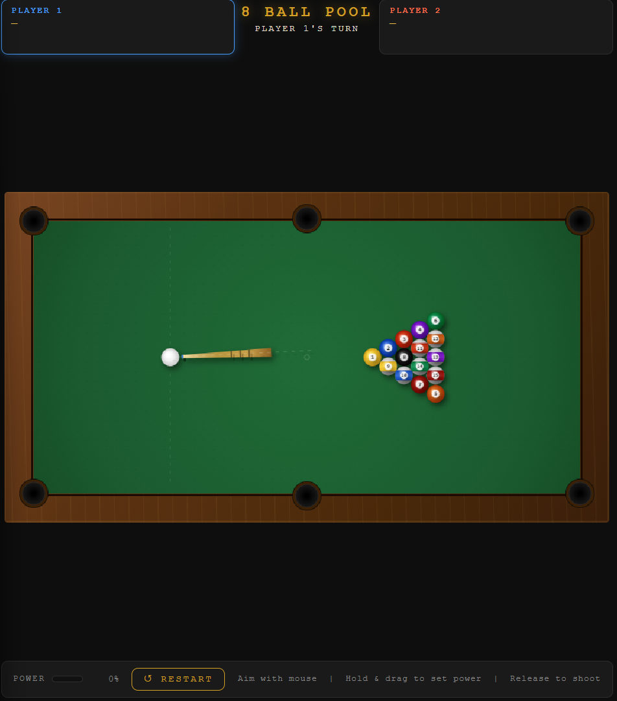

# 🎱 8 Ball Pool

یک بازی بیلیارد تحت وب که با HTML، CSS و JavaScript ساخته شده است.

## اجرای آنلاین

https://amir-ashkan-ghasemi-tj.github.io/Real-Time-System-PRJ/

## امکانات

- بازی دو نفره
- فیزیک برخورد توپ‌ها
- نشانه‌گیری با موس
- تعیین قدرت ضربه
- سیستم امتیازدهی
- تشخیص توپ‌های سالید و استرایپ
- قوانین پایه بازی 8 Ball

## فایل‌های پروژه

```text
index.html
style.css
game.js
```

## اجرا

کافی است فایل `index.html` را در مرورگر باز کنید یا از لینک آنلاین استفاده کنید.

## تصویر بازی




## توسعه‌دهنده

Amir Ashkan Ghasemi
